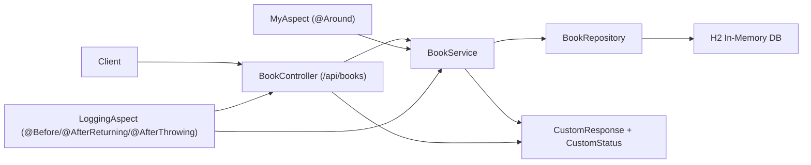

# Spring AOP Demo - Production-Style AOP Showcase

A focused Spring Boot backend that demonstrates practical Aspect-Oriented Programming around a simple book catalog domain.
The project highlights how to keep service logic clean while handling logging, exception mapping, and execution metrics through reusable aspects.

## Highlights

- Spring AOP implementation with reusable pointcuts and multiple advice types
- RESTful CRUD-style flow for books with a consistent `CustomResponse<T>` contract
- Layered architecture (`controller` -> `service` -> `repository`) with cross-cutting concerns separated into `aop`
- `@Around` advice for timing and safe exception wrapping in service operations
- Additional logging aspect for `@Before`, `@AfterReturning`, and `@AfterThrowing` visibility
- Integration-style HTTP test coverage via Spring Boot Test + MockMvc

## Architecture



### How it works (high level)

- Client requests enter through `BookController` under `/api`.
- `BookService` handles business operations and returns typed `CustomResponse<Book>`.
- `BookRepository` persists and reads entities from H2 in-memory storage.
- `MyAspect` intercepts `get*` and `add*` service methods to time calls and convert unexpected failures.
- `LoggingAspect` traces method calls, successful results, and propagated exceptions.

## Engineering Challenges

- Applying AOP without coupling business logic to logging/error infrastructure
- Preserving a stable API response contract for both happy-path and exception cases
- Keeping pointcuts explicit and maintainable as service methods evolve
- Balancing observability detail with minimal runtime overhead

## My Contribution

- Designed the layered API flow for `Book` operations with centralized response modeling.
- Implemented AOP pointcuts and advice orchestration for timing, argument/result logging, and exception tracing.
- Added around-advice exception wrapping to keep service responses consistent.
- Implemented startup data bootstrap to make local testing immediate.
- Added integration-focused API verification with Spring Boot test context.

## Tech Stack

- **Backend:** Java 17, Spring Boot 3, Spring Web, Spring Data JPA, Spring AOP
- **Data:** H2 (in-memory)
- **Build:** Maven
- **Testing:** JUnit 5, Spring Boot Test, MockMvc

## Quick Start

### Prerequisites

- Java 17
- Maven 3+

### Run application

```bash
git clone https://github.com/DiacencoDumitru/spring-aop-demo.git
cd spring-aop-demo
mvn spring-boot:run
```

Service starts on `http://localhost:8080`.

## How to Verify

```bash
# run integration-style tests
mvn test

# quick manual smoke checks
curl -X GET http://localhost:8080/api/books
curl -X GET http://localhost:8080/api/books/Clean%20Code
curl -X POST http://localhost:8080/api/books -H "Content-Type: application/json" -d "{\"title\":\"Domain-Driven Design\",\"author\":\"Eric Evans\"}"
```

## Key Endpoints

- `GET /api/books` - fetch all books
- `GET /api/books/{title}` - fetch one book by title
- `POST /api/books` - create a new book

## Why This Project

This project is a compact interview-ready demonstration of practical Spring AOP usage:

- clear separation between core logic and cross-cutting concerns
- measurable and observable service behavior
- consistent error handling strategy across layers

## Project Structure

- `src/main/java/course/springaop/controller` - REST entry points
- `src/main/java/course/springaop/service` - business logic
- `src/main/java/course/springaop/repository` - JPA persistence
- `src/main/java/course/springaop/aop` - aspects and pointcuts
- `src/main/java/course/springaop/util` - response/status utilities
- `src/test/java/course/springaop` - integration test entry

## Author

Dumitru Diacenco, Java Backend Engineer
